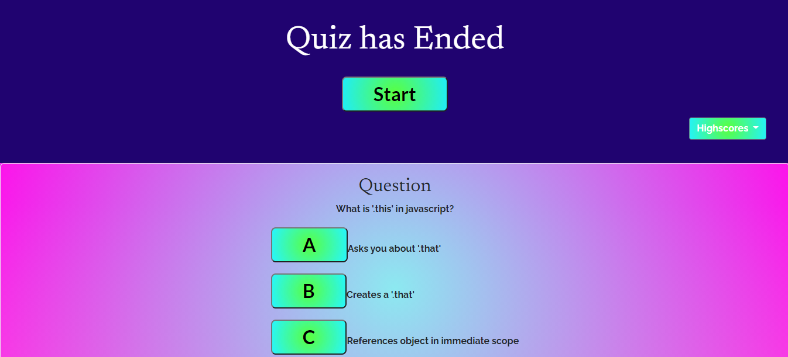

# Javascript Code Quiz

For this project I was given the task of creating a quiz about coding using HTML, CSS and Javascript while starting from scratch. This project will ask the user to answer a series of timed multiple choice questions about different aspects of coding.

The objectives to complete this project include the following:
* A working start button that begins the quiz and cannot be clicked during it
* When the quiz begins a timer starts to countdown
* After answering a question another question is presented
* If the answer is incorrect then time is subtracted
* When the quiz is finished or the time runs out then the game is over
* Initials are recorded along with score

Technologies used:
* HTML
* CSS
* Javascript
* Bootstrap
* Google Fonts

Welcome Screen

Middle of Quiz

End of Quiz

View Live Webpage!
https://alec74.github.io/codeQuiz/

Contact Information:
* Github: https://github.com/Alec74
* Email: alecmcglone@gmail.com
* LinkedIn: https://www.linkedin.com/in/alec-mcglone-900904206/